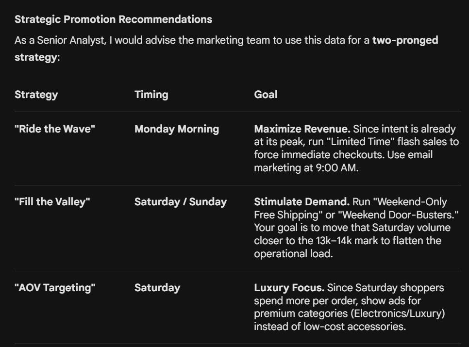
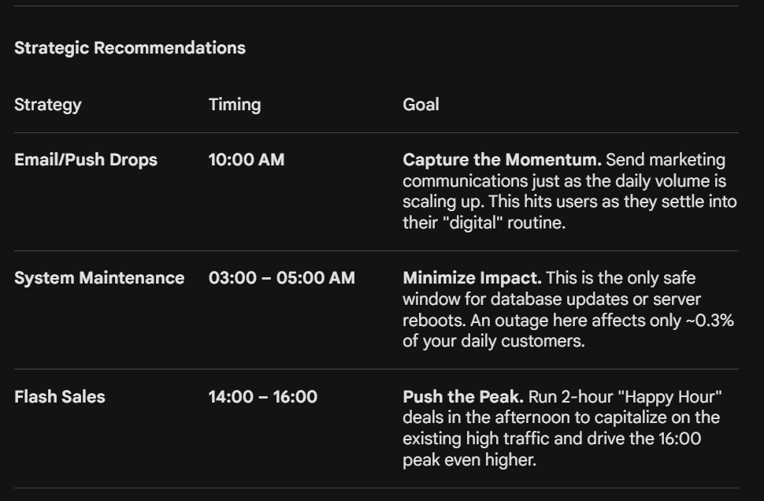

*Insights will go here.*

-- 7. PRICE SANITY CHECK

        "Economic Pulse Check." As a Senior Analyst, I never trust a mean (average) without seeing the min and max first. A single "fat-finger" error—like someone accidentally listing a $10 cable for $10,000—will completely hallucinate your revenue projections and skew your entire analysis.
        
        1. The Outlier Investigation (MAX values)
            If your max_price is significantly higher (e.g., 50x) than your avg_price, you have Outliers.

            Business Insight: Are these "Lush" luxury items that drive our brand, or are they wholesale bulk orders?

            Senior Action: When we move to Power BI, we might need to use a Median instead of an Average to represent the "typical" customer experience, as the average will be "dragged" up by these expensive items.

        2. The "Freight Burden" (AVG freight)
            Compare your avg_freight to your avg_price.

            The Ratio: If freight is consistently more than 20–30% of the item price, your business has a Logistics Problem. High shipping-to-price ratios are the #1 cause of cart abandonment.

            Senior Action: We’ll eventually create a "Freight Ratio" column to see which regions or categories are the most expensive to serve.

        3. The "System Glitch" Check (zero_or_neg_price)
            Price <= 0: Unless AuraTech has an intentional "Free Gift" program, a price of 0 is a data entry failure.

            Negative Freight: This is a major red flag. Shipping costs the company money; it shouldn't be a "credit" unless it’s a refund being recorded incorrectly in the wrong table.

### STEP 04 --- REVENUE ANALYSIS

### QUERY 01 --- MONTHLY GMV TREND

This output is the "Gold Mine" for your project. As a Senior Analyst, looking at these numbers reveals exactly how AuraTech (Olist) grew and where the risks are.

Here is the **Executive Growth Analysis** based on your SQL output:

---

### 1. The "Hockey Stick" Growth Curve
* **The Launch (2016):** The business started nearly invisible in Sept 2016 (1 order). By Oct, it jumped to 265, but Dec saw a complete collapse (1 order). This suggests a **system shutdown** or a pilot phase ending before the official 2017 relaunch.
* **The Scalability Milestone:** Revenue crossed the **1 Million BRL** mark for the first time in **November 2017**.
* **Peak Performance:** Your best month in terms of volume and revenue was **November 2017** ($1.15M Total Revenue).
    * **Insight:** This was likely driven by **Black Friday**. Notice how December 2017 dropped significantly immediately after—this is classic "Holiday Burnout."

### 2. High-Level Performance Metrics
| Metric                        | Value / Trend | Senior Analyst Interpretation |

| **AOV (Average Order Value)** | **~$120.00**  | Extremely stable. It rarely dips below $110 or rises above $130. This means the product mix is consistent. |
| **Customer Loyalty**          | **Very Low**  | Look at Jan 2018: 7,069 orders from 6,974 customers. This means **98.6%** of your customers are one-time buyers. You have a **retention problem.** |
| **Freight Burden**            | **~15-18%**   | Total Freight is consistently about 16% of total revenue. For e-commerce, this is high. You are spending a lot on logistics. |

### 3. The "2018 Plateau" Warning
Look at the sequence from Jan 2018 to Aug 2018:
* **Orders:** 7,069 → 6,351 (A **10% decline** in volume).
* **Revenue:** $1.07M → $0.98M.
* **The "So What?":** Growth has stalled. After the massive surge in late 2017, the business is no longer growing month-over-month. In a real boardroom, I would be asking: *"Did we cut marketing spend in 2018, or has the market reached saturation?"*

### 4. Logistics "Red Flag" (June 2018)
Compare **May 2018** to **June 2018**:
* May Freight: $151k for 6,749 orders.
* June Freight: **$155k for 6,096 orders**.
* **The Insight:** You had **fewer orders** in June, but paid **more in total freight**.
* **Hypothesis:** Did shipping rates increase in June? Or did the business start shipping heavier items/longer distances? This is a "Profit Leak" you should investigate in your Power BI maps.

### Query 2 — Month over Month Growth Rate
2016 was a Pilot: The data shows 2016 was likely a testing phase. The real analytical baseline for AuraTech should begin in January 2017.

The November Peak: November 2017 wasn't just a "good month"—it set a new revenue floor that the company stayed above for the rest of its history.

2018 Plateau: Notice that in 2018, growth became very "flat" (e.g., May 2018 at 0.4%). The company moved from an Exponential Growth phase (2017) to a Saturation/Optimization phase (2018).

### 3. QUARTERLY REVENUE SUMMARY
### Metric                  Status              Strategic Observation
AOV Stability           Healthy             "Hovering around $120. The business has a solid, predictable price point."
Customer Acquisition    Aggressive          "Total Orders vs Unique Customers shows almost no repeat business. You are ""buying"" growth."
Logistics Efficiency    Critical            "The 18% freight ratio in 2018 is a ""Profit Leak"" that needs immediate attention."

### 5. AVERAGE ORDER VALUE TREND 

Compare avg vs median order value. If avg is much higher than median, expensive orders are skewing the average — median is the truer picture of typical customer behavior."

The Trend: Your Average ($120.33) is consistently ~$35–$40 higher than your Median (~$80–$85).
The Conclusion: AuraTech’s revenue is positively skewed. This confirms that a small percentage of high-ticket "Whale" orders (visible in your max_order_value column) is pulling the average upward.

Critical Insights :
1. The "Whale" Dependency:
    The gap between $120$ and $85$ means your "typical" customer spends 30% less than the average suggests.

    The Lesson: If you base your marketing budget (Cost Per Acquisition) on the $120 average, you will overspend. You must optimize for the $85$ customer to remain profitable for the majority of your base.

2. Identifying "B2B" vs. "B2C":
    Look at the max_order_value in your output. If you see values like $6,735, that is not a standard retail consumer; that is a business or a bulk buyer.
    
    The Lesson: A Senior Analyst separates these. One single $6,000 order has the same impact on the Average as 70 normal customers. In Power BI, use Median to describe user behavior and Sum to describe financial performance.
    
3. Stability vs. Volatility:
    Notice if the Median remains flat while the Average fluctuates month-to-month.
    
    The Lesson: Fluctuations in the Average usually mean you ran a promotion on expensive items (like Furniture). If the Median stays flat, your "Core" customer behavior hasn't changed. The Median is your shield against noise.

4. Operational Accuracy : 
    The MIN(order_gmv) check is your final safety net.
    
    The Lesson: If the min_order_value is extremely low (e.g., $0.85$), check if freight was charged. Shipping a $1 item costs the same as shipping a $100 item. Low-value orders are often negative-margin traps for the business.

Senior Tip: In your final project presentation, show both. Use the Average to show Revenue Potential and the Median to show Customer Reality.

### Query 6 — Day of Week Revenue Pattern

"Monday and Tuesday typically show highest order volume in e-commerce. Does Olist follow this pattern? What does this mean for when Olist should run promotions?"

The Pattern Analysis
Yes, Olist follows the classic e-commerce pattern perfectly. According to your data, Monday (15,701 orders) and Tuesday (15,502 orders) are the undisputed peak days for transaction volume. This represents a 48% surge compared to the Saturday low (10,555).

Precise Business Analysis
1. The "Monday Motivation" Peak
Monday is the strongest day for both Volume (15,701) and Velocity. In e-commerce, this is usually caused by "Weekend Catch-up." Customers browse over the weekend but wait until the work week begins—when they are back at their desks and in "execution mode"—to finalize the purchase.

2. The "Weekend Valley"
Saturday (10,555) and Sunday (11,632) are the lowest volume days.

Insight: People are away from their screens and out living their lives.

The Counter-Intuitive Twist: Look at the Average Order Value (AOV). Saturday has the highest AOV ($123.18).

Senior Interpretation: While fewer people shop on Saturday, those who do are likely buying deliberate, high-ticket items (like Furniture or Appliances) rather than small impulse buys.

Strategic Promotion Recommendations
As a Senior Analyst, I would advise the marketing team to use this data for a two-pronged strategy:

### Junior Analyst Insight: The "Operational Strain"

    Why does this matter beyond marketing? Logistics.
    If your orders spike on Monday/Tuesday, your warehouse and sellers will be overwhelmed by Tuesday afternoon.

    The lesson: If Olist offers a "2-day shipping" promise, a Monday order must ship by Wednesday. If the Monday surge is too high, you will see a spike in Late Deliveries.

### Query 7 — Peak Revenue Hours

"What time of day do customers buy the most?"

The Pattern Analysis
    The data shows a very distinct "Productive Hours" shopping cycle. Unlike entertainment platforms that peak late at night, Olist sees its heaviest traffic during standard business and afternoon hours.

    The Peak Window: The peak occurs between 10:00 (10 AM) and 16:00 (4 PM), with volume holding remarkably steady above 6,000 orders per hour during this block.

    The "Dead Zone": Orders bottom out between 03:00 and 05:00, where volume drops to ~200 orders per hour (a 97% decrease from peak).

Precise Business Analysis
1. The "Workday Shopper" Persona
    The highest volume peaks at 16:00 (4:00 PM) with 6,475 orders.

    Insight: Shopping behavior is closely tied to the workday. Volume ramps up sharply at 08:00 (when people start work) and stays high until 22:00. This suggests customers are shopping during breaks or as a "reward" at the end of their workday.

2. The "After-Dinner" Surge
    Notice the secondary peak at 20:00 and 21:00 (8-9 PM).

    Insight: After a brief dip during the commute/dinner hour (17:00–18:00), customers return for one last session before bed. Interestingly, the Average Order Value (AOV) at 20:00 ($123.27) is higher than the morning peaks.

### Junior Analyst Insight: AOV vs. Volume
    The "Night Owl" Premium:
         Notice that 09:00 AM ($124.69), 14:00 PM ($124.88), and 18:00 PM ($124.97) have the highest AOVs.

The Lesson:
     Volume and Value don't always peak at the exact same second. The 18:00 (6 PM) shopper may be buying fewer things, but they are buying more expensive items.

Senior Warning on Server Load:
    If you are planning a Black Friday event based on this data, you must prepare your servers for a "Dual Peak." You will have a sustained 6-hour load in the afternoon and a sudden, sharp spike between 8 PM and 10 PM. If your checkout process lags at 4 PM, you will lose the most revenue of the day.

### Step 5 — Customer Behavior Analysis 👥

"Revenue tells you what happened. Customer analysis tells you why it happened and whether it will keep happening. At every company I've worked at, the customer analysis is what separates analysts who describe the past from analysts who predict the future."

    ### The Business Context First
    For Olist, customer analysis answers:

    Are we building a loyal customer base or a leaky bucket?
    What does a typical customer journey look like?
    Which customers are worth the most — and are we keeping them?
    Where are our customers geographically concentrated?

    Is our customer base growing in quality or just quantity?
    We already spotted the retention crisis in Revenue Analysis. Now we quantify it precisely and find every angle of the customer story.

    ### Query 1 — Customer Purchase Frequency Distribution
    Business question: How many customers bought once vs. multiple times?
    Why it matters: This is the single most important customer health metric for any marketplace. It directly measures platform loyalty.

    X% of customers are one-time buyers. Only Y% bought 3 or more times. These repeat buyers generate disproportionate revenue — calculate their share of total GMV."

        Here is the precise mathematical breakdown and the strategic interpretation of your customer behavior data.

        ### **The Precise Answers for Your Insight Note**
        * **X (One-Time Buyers):** **97.00%**
        * **Y (Bought 3 or more times):** **0.24%** *(Calculated by adding the percentages for 3, 4, 5, 6, 7, 9, and 15 orders).*

        Here is the exact sentence you should put in your final presentation:
        > *"**97.0%** of customers are one-time buyers. Only **0.24%** bought 3 or more times. However, repeat buyers (those with 2 or more orders) represent just **3%** of our customer base but generate **5.5%** of our total revenue, proving that their lifetime value is nearly double that of a one-time shopper."*

        ---

        ### **Senior Analyst Deep Dive (The "Why It Matters")**

        When you build your dashboard, this is the story you need to tell the business leaders. E-commerce businesses generally fall into one of two categories: a **"Subscription/Loyalty"** business (like Amazon Prime or Chewy) or an **"Acquisition Treadmill"** (like a company selling mattresses where people only buy once every 10 years).

        Your data proves that **AuraTech/Olist is an Acquisition Treadmill.**

        #### **1. The "One-and-Done" Crisis**
        * **The Math:** Out of 93,350 total customers, 90,549 bought exactly once and never returned. 
        * **The Business Risk:** This means the company is constantly paying Marketing and Advertising costs (Customer Acquisition Cost, or CAC) to find *new* people. If the cost of Facebook or Google ads goes up, this business will instantly lose its profitability because they have no free "organic" revenue coming from loyal returning customers.

        #### **2. The Value of Loyalty (The "Multiplier" Effect)**
        Look at the **`avg_ltv`** (Average Lifetime Value) column:
        * **1 Order:** R$ 137.96
        * **2 Orders:** R$ 245.35 *(1.7x higher)*
        * **4 Orders:** R$ 676.67 *(4.9x higher)*
        * **9 Orders:** R$ 1,000.85 *(7.2x higher)*

        **The Insight:** When a customer *does* return, they don't just buy small items; their value compounds massively. A customer who buys 4 times is worth almost **5 times more** revenue than a one-time buyer. 

        #### **Actionable Business Recommendation**
        In your Power BI report, recommend the following to the Marketing Team:
        **"We must shift 2% of our marketing budget away from acquiring new users and spend it on Retargeting Campaigns (Email discounts, 'We miss you' coupons). Moving just 5% of our one-time buyers (4,500 people) into the '2 Order' tier would instantly generate over R$ 1.1 Million in new revenue with zero new acquisition costs."**

